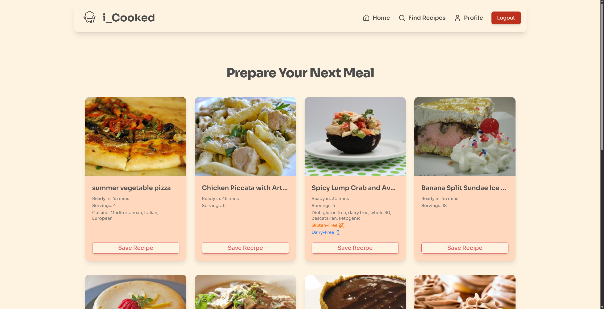
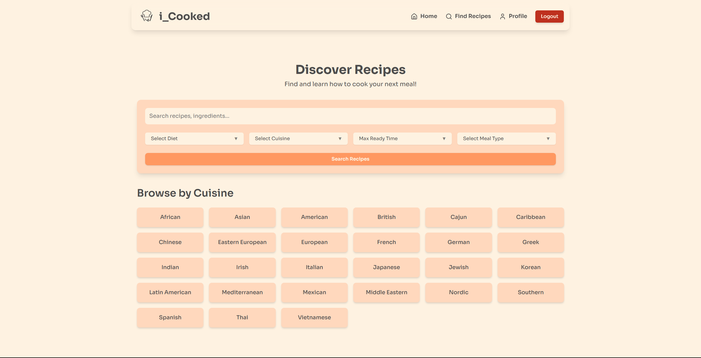
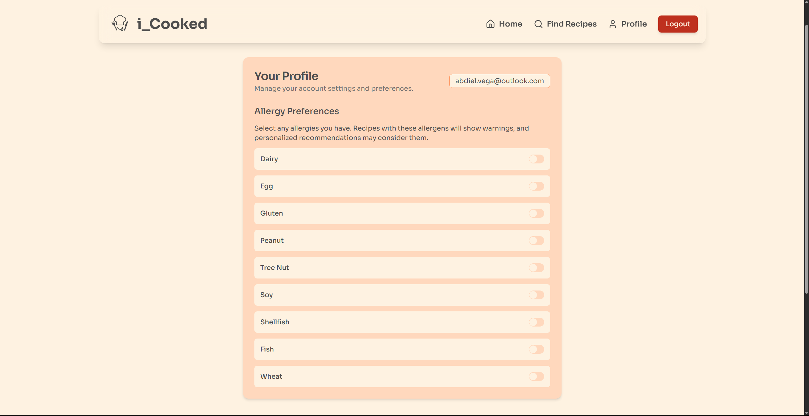
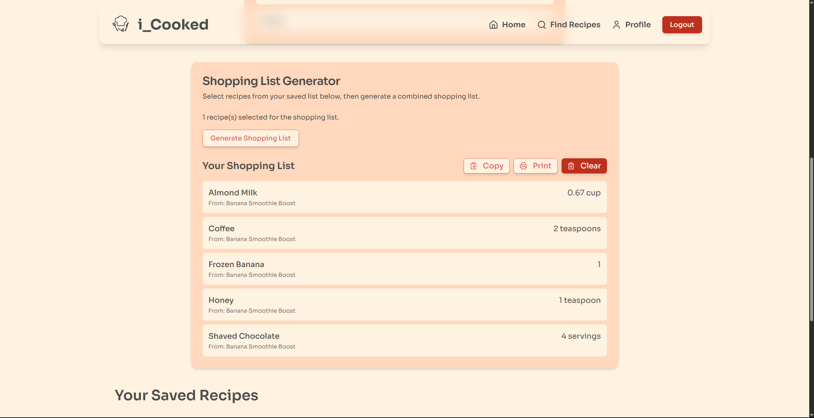

# i_Cooked - Your Personal Recipe Management Hub

Welcome to **i_Cooked**, a web application designed to help you discover, save, and organize your favorite recipes, manage dietary preferences, and simplify your grocery shopping!

_Fig 1: i_Cooked Home Page - "Prepare Your Next Meal" section._

## Overview

i_Cooked is a feature-rich platform for food enthusiasts. Whether you're looking for inspiration for your next meal, trying to manage specific dietary needs, or want an easy way to create shopping lists, i_Cooked has you covered. It leverages the Spoonacular API to provide a vast database of recipes and nutritional information.

## Key Features

### 1. Recipe Discovery & Personalized Suggestions

- **Dynamic Home Page:** Get inspired with a fresh batch of random recipe suggestions every time you visit.
- **Personalized Recommendations:** For logged-in users, i_Cooked analyzes your saved recipes to suggest new dishes based on your preferred cuisines, diets, and meal types.
- **Browse by Cuisine:** Explore diverse culinary traditions by browsing recipes from various cuisines like Italian, Mexican, Indian, and more.

### 2. Advanced Recipe Search & Filtering

- **Comprehensive Search:** Find recipes by keywords, ingredients, or specific dish names.
- **Powerful Filters:** Narrow down your search results by:
  - Diet (e.g., Vegetarian, Vegan, Gluten-Free)
  - Cuisine
  - Maximum ready time
  - Meal type (e.g., breakfast, lunch, dinner, dessert)
- **Clear Results Display:** View search results in an easy-to-navigate grid, complete with essential recipe information.

_Fig 2: Discover Recipes page with search and filter options._

### 3. User Accounts & Personalization

- **Secure Authentication:** Easy sign-up, login, and logout functionality.
- **User Profile:** Manage your account details and preferences in one place.
- **Allergy Management:**
  - Select and save common allergies (e.g., Dairy, Gluten, Peanuts, Shellfish).
  - Recipes that potentially contain your specified allergens will display clear warnings.

_Fig 3: User Profile page showing allergy preferences._

### 4. Save & Organize Recipes

- **Save Favorites:** Easily save any recipe you like to your personal collection with a single click.
- **My Saved Recipes:** Access all your saved recipes on your profile page, making it simple to find them again.

### 5. Shopping List Generator

- **Smart Aggregation:** Select one or more recipes from your saved list to generate a consolidated shopping list.
- **Ingredient Consolidation:** i_Cooked automatically combines identical ingredients from different recipes, summing up quantities.
- **Easy Management:**
  - View the generated list with clear item names, quantities, and units.
  - See which recipes each ingredient belongs to.
  - Options to **Copy** the list to your clipboard, **Print** it for offline use, or **Clear** the list.

_Fig 4: Shopping List Generator with a generated list._

### 6. Interactive Recipe Viewing

- **Detailed Modals:** Click on any recipe card to open a detailed view in a modal, showing:
  - Recipe image
  - Title
  - Summary
  - Allergen warnings (if applicable based on your profile settings)
  - Full ingredient list
  - Step-by-step cooking instructions
- **Seamless Browsing:** View recipe details without navigating away from your current page (e.g., search results, home page).

## Technologies Used (Example)

- **Frontend:** Next.js (React), TypeScript, Tailwind CSS
- **Backend/Database:** Supabase (for user authentication and storing saved recipes/preferences)
- **API:** Spoonacular API (for recipe data)
- **UI Components:** Shadcn/ui
- **State Management:** React Context API
- **Styling:** Tailwind CSS
